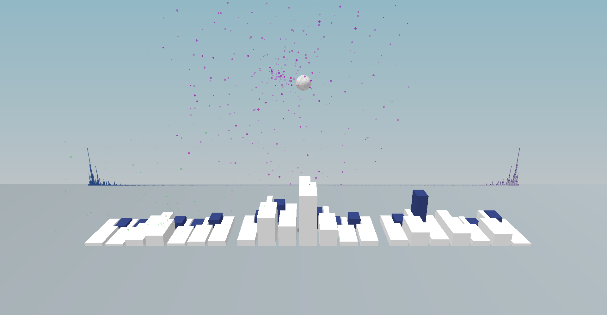
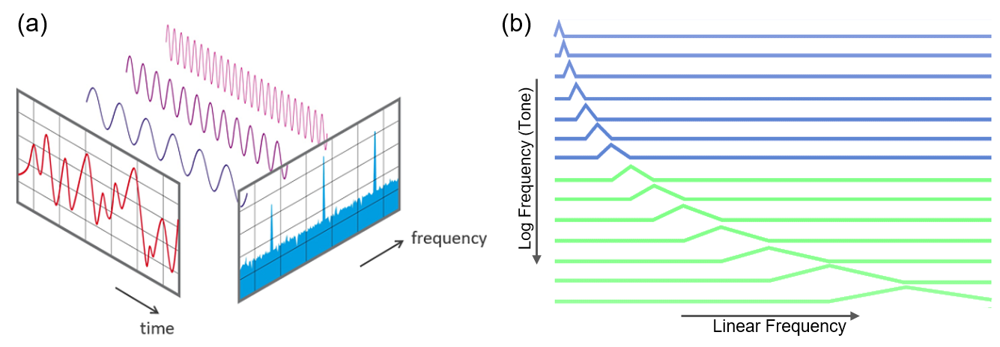
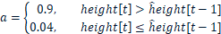
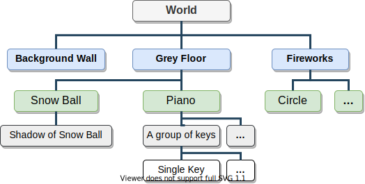
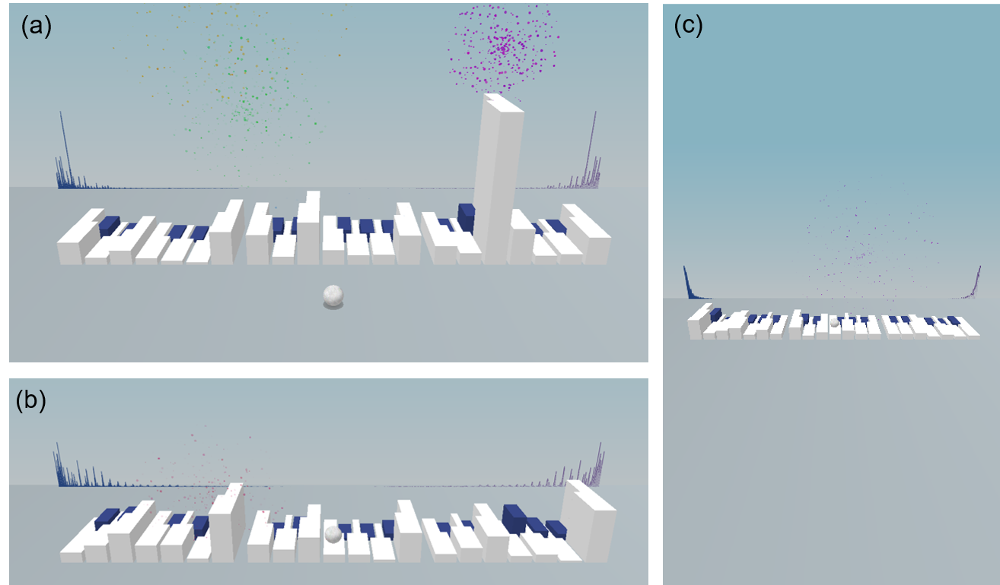
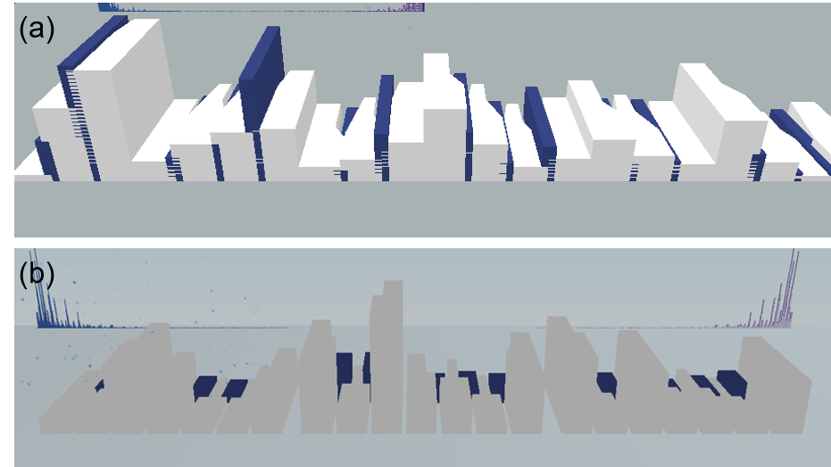

# The Music Visualizer

This is a coursework project of CPT205 Computer Graphics Assignment2: 3D Modeling Project, Xi'an Jiaotong-Liverpool University.

## **How to play**: 

Just download in the "Release" area and no need to install.  
Please make sure to turn on your speaker first!

**Open a music:**

Drop a music file to the visualizer, or right click a music file and open with the visualizer.

**Overall usage**:

- **Arrow keys** move the ball, and
- **Space key** jumps the ball.

**Player Stage:** Please enjoy the music first, if the music is successfully opened.

- Press **P** to **pause** the music.

**Free Stage:** After the music is finished, you can try to interactive by:

- **Moving** the ball to **hit** the piano keys, or
- **Clicking** on the piano keys with the mouse.

## Technical Report

#### **1.**   **Introduction**

The music visualization is typically a feature in the media player software, which can generate the animation from pieces of music and render in real time with the music as it is playing. This report purposes a quite beautiful music visualizer as the assignment of CPT205 module. The purposed music visualizer uses Fourier Transform to get the volume on different frequencies, and then uses a range of graphics techniques, such as hierarchical modelling, viewing and projection, lighting and materials, and texture mapping to render the 3D scene, piano keys, snow balls and other objects while the music is playing. The project also contains some interesting interactions between the user and snowball, the user and piano keys, and between the snowball and piano keys.

#### **2.**   **Audio Signal Processing**

Audio signal processing is a crucial part of this assignment. Because human is very sensitive to continuous audio signals, there are quite a few details to consider in terms of audio-video synchronization and waveform generation. I will briefly introduce this part.

**2.1**    **Music Transcription**

Audio transcription is the practice of notating a piece or a sound in wave format. In simple terms, it is to get the intensity of each musical note (do, re, mi…) at the current time. First, I crop a piece of music which has 2048 samples. The Hanning window function [1] is multiplied to the corresponding samples:

Then the Fast Fourier Transform (FFT) [2], shown in Figure 1(a), is applied to this piece of Hanning weighted data:

After that, for each piano key, I purposed a set of triangle filters, which is similar to Mel spectrum to get the height of the piano key from the result of the Fourier Transform:

In this formula, $w[k]$ is the result of FFT, and $k_0, k_L, k_H$ are the frequency of the current musical note, lower note, higher note respectively in the transformed frequency axis. Figure 1(b) shows the purposed triangle filters. 

<b>Figure 1. (a)</b> The Fourier Transform, <b>(b)</b> The purposed triangle filters.

When rendering the heights of piano keys and the raw FFT results, a Time-Smoothed technique [3] is applied to the heights, to reduce the intense jumping of the piano keys:

**2.2**    **Audio Decoder and Player**

To be able to play music in sync, I use the Miniaudio [4] library to operate the audio device. It is quite small and in single header file. The library will call the callback function when the next piece of audio is needed. I need to copy the next specified number of frames (typically 480) to the specified address in the callback function.

#### **3.**   **Graphics and Rendering**

This assignment uses a range of the various graphics techniques learned in this module, e.g. hierarchical modelling, viewing and projection, lighting and materials, and texture.

**3.1**     **Hierarchical Modelling**

<b>Figure 2</b> The hierarchical tree of this project

In order to draw each object in a hierarchical way and to perform the coordinate system transformation in a reasonable way, I use the hierarchical modeling method. Figure 2 shows the hierarchical tree of the objects. To facilitate the interaction of different objects, most of the time I'm using the floor coordinate.

**3.2**     **Viewing and Projection**

This project uses the perspective projection. To avoid the stretching or squashing of the screen when the window is resized, I call the viewport and perspective function in the reshape callback function.

<b>Figure 3. (a)</b> The initial shape of window, <b>(b)</b> The squashed window, <b>(c)</b> The narrow window.

However, there was another problem. The gluPerspective function has a parameter fovy, which means the viewable angle of pitch axis is constant. But the viewable angle of yaw axis should be constant if we want to see the whole piano when the window is reshaped. So, I re-implemented the perspective function to solve this problem, as shown in Figure 3.

**3.3**     **Geometry and Lighting**

OpenGL never has a geometry of “piano key”. So, I storage the shape of a piano key by a vector of all points of the bottom surface, and a height value. When drawing the piano key, I drew the upper surface, lower surface as polygons at first, and side surfaces as quads. The problem is that the shape of white piano keys are not convex polygons so OpenGL can not properly draw. The screen shot is shown in Figure 4(a). My solution is to draw two rectangles for each upper or lower surface.

<b>Figure 4. (a)</b> Draw non-convex polygon with OpenGL, <b>(b)</b> Polygons without normal vectors.

The normal vectors of each vertex of each polygon should be correctly calculated and set, to get the correct lighting and shading effects. Figure 4(b) shows the screenshot when the normal vectors of the piano keys are not correctly set.

**3.4**     **Texture**

To get a snowball effect, a photo of a snowy field was used as the sphere's mapping. Figure 5 shows the texture and screenshots.

<b>Figure 5. (a)</b> The show texture, <b>(b)</b> Sphere without texture, <b>(c)</b> Sphere with error texture environment parameters, <b>(d)</b> Sphere with texture but no lighting, and <b>(e)</b> Final result.

#### **4.**   **Interaction**

The interaction can be happened between human and the program or between the two objects. Figure 6 shows the main interaction methods in this project. The human player can control the snow ball by using arrow keys and space key for jumping. Through my physics engine, the ball and the piano will affect each other, such as playing sounds or changing the movement of the ball.

<b>Figure 6.</b> The interaction methods between human and serval objects

#### **References**

[1]  “numpy.hanning — NumPy v1.21 Manual.”
 https://numpy.org/doc/stable/reference/generated/numpy.hanning.html (accessed Dec. 13, 2021).

[2]  “FFT in a single C-file - Stack Overflow.” https://stackoverflow.com/questions/8801158/fft-in-a-single-c-file (accessed Dec. 13, 2021).

[3]  “java - How to filter FFT data (for audio visualisation)?,” Stack Overflow.
 https://stackoverflow.com/questions/20408388/how-to-filter-fft-data-for-audio-visualisation (accessed Dec. 13, 2021).

[4]  “miniaudio - A single file audio playback and capture library.” https://miniaud.io/ (accessed Dec. 13, 2021).

## Contact

Any questions, problems or suggestions, please contact:

Jingyi Wang  
E-mail: Wangjingyi70@gmail.com
